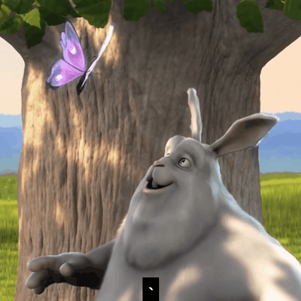

YouTube shortcuts Google Chrome extention

Press the `` ` `` or `~` key to activate the shortcuts when a youtube video page is opened

Features: loop segment, control speed, save frame, hide overlay, float video...

Shortcuts | Description
-|-
<kbd>`</kbd> | Toggle shortcuts
<kbd>z</kbd> | Show shortcuts
<kbd>a</kbd> | Set start
<kbd>s</kbd> | Load start
<kbd>d</kbd> | Set end
<kbd>e</kbd> | Load end
<kbd>r</kbd> | Remove end
<kbd>g</kbd> | Skip Ad
<kbd>h</kbd> | Like
<kbd>y</kbd> | Dislike
<kbd>u</kbd> | Focus video
<kbd>b</kbd> | Toggle float
<kbd>n</kbd> | Save frame
<kbd>Alt+Num</kbd> | Playback Rate
<kbd>p</kbd> | Toggle overlay
<kbd>q</kbd> | Close Overlays

